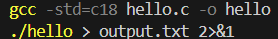

# Sintaxis y Semantica de Lenguajes

## k2152
wingm instalado: *gcc 13.2.0*

comando de compilado:

```
gcc -std=c11 hello.c -o hello
./hello > output.txt 2>&1
```



### changelog
4/4/2025 - agregada carpeta de tp0